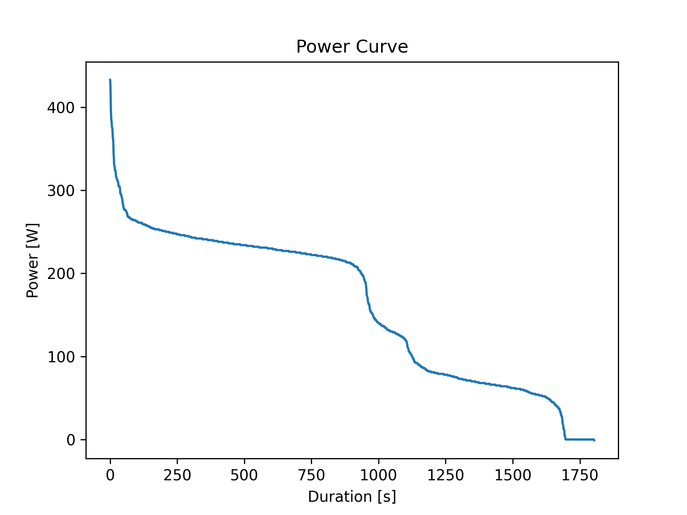

# Aufgabe 1 - Power Curve

Dieses Projekt ist im Rahmen der Software Engineering Vorlesung entstanden. Es geht darum, aus einer CSV-Datei mit Aktivitätsdaten eine Power Curve zu erstellen.

## Was macht das Projekt?

Wir lesen Leistungsdaten aus einer `activity.csv` Datei ein, sortieren die Werte mit einem selbst geschriebenen Bubble Sort Algorithmus und plotten dann die Power Curve als Grafik. Das Ergebniss wird als PNG im `figures/` Ordner gespeichert.



## Projektstruktur

- `main.py` - Hauptskript, hier wird alles zusammengefügt
- `load_data.py` - Lädt die CSV-Datei und gibt die Spalten als Dictionary zurück
- `sort.py` - Enthält die Bubble Sort Implementierung
- `power_curve.py` - Erstellt den Plot der Power Curve mit matplotlib
- `activity.csv` - Die Eingabedaten (Aktivitätsdaten mit Leistungswerten)
- `figures/` - Hier landen die generierten Grafiken

## Setup

Das Projekt verwendet PDM als Package Manager. Python >= 3.12 wird benötigt.

```bash
pdm install
``` 

## Ausführen

Einfach das main.py skript starten:

```bash
pdm run python main.py
```

Oder direkt mit dem venv:

```bash
python main.py
```

## Abhängigkeiten

- numpy
- matplotlib

## Autoren

- Franzi Bernecker
- Laurenz Keller

