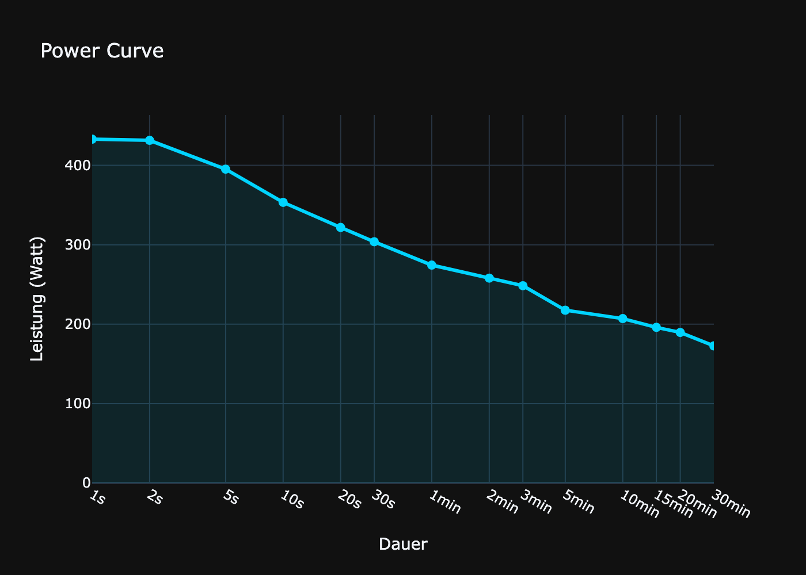

# Abgabe 3 — Leistungskurve (Power Curve)

Dieses Python-Projekt berechnet und visualisiert die sportwissenschaftliche Leistungskurve (Power Curve) aus Radsport-Aktivitätsdaten.

---

## Kurzbeschreibung

Die Module lesen Leistungsdaten (Watt), validieren sie, berechnen maximale Durchschnittsleistungen über verschiedene Zeitintervalle und erstellen einen Plot der Power Curve.

Hauptfunktionen:
- Datenvalidierung (fehlende Werte, unplausible Zeitangaben, reine Nullen)
- Berechnung der maximalen Durchschnittsleistung für verschiedene Intervalle
- Visualisierung der Power Curve

---

## Voraussetzungen

- Python 3.12 oder neuer
- PDM (oder alternativ pip/venv)

---

## Installation & Start

1. Abhängigkeiten installieren:

```bash
pdm install
```

2. Programm starten:

```bash
pdm run python src/main.py
```

---

## Projektstruktur

```
./
├── Data/                   # Eingabedaten (z. B. activity.csv)
├── src/                    # Quellcode
│   ├── main.py             # Einstiegspunkt
│   ├── power_curve.py      # Berechnung und Hilfsfunktionen
│   └── read_data.py        # Einlesen & Vorverarbeitung
├── results/                # Ausgabedateien (Plots, Tabellen)
├── pyproject.toml
└── README.md
```



---

## Datenformat

Die erwartete CSV-Datei (z. B. `Data/activity.csv`) sollte mindestens die folgenden Spalten enthalten:

- `PowerOriginal` — Leistungswerte in Watt
- `Duration` — Dauer/Auflösung der Messpunkte in Sekunden

Hinweis: Weitere Spalten werden toleriert, solange die beiden oben genannten vorhanden sind

---

## Wie es genau funktioniert

- Dynamische Fensterwahl: Das Programm verwendet eine standardisierte 1-2-5-Reihe (z. B. 1s, 2s, 5s, 10s, 30s, 60s, 300s, 1800s, …) und ergänzt zusätzlich immer die exakte Gesamtdauer der Aktivität als Fenster. So ist z. B. eine 30‑Minuten-Auswertung (1800s) automatisch enthalten, sofern die Aktivität lang genug ist.
- Zeitliche Auflösung / `Duration`: Jeder Messwert kann eine eigene `Duration` haben — es wird also nicht von festen 1‑Sekunden-Samples ausgegangen. Die Berechnung arbeitet mit kumulierter Zeit (cumulative time) und summiert innerhalb eines Fensters die gewichtete Leistung (`PowerOriginal * Duration`), teilt durch die gesamte im Fenster betrachtete Dauer und erhält so das genaue zeitgewichtete Mittel.
- Sliding-window-Logik: Für jedes Fenster (z. B. 10s, 30s, 60s ...) verschiebt der Algorithmus das Startfenster über die Messreihe, berechnet die durchschnittliche Leistung über alle überlappenden Messwerte (unter Berücksichtigung ihrer Dauer) und nimmt das Maximum über alle Startpositionen als Ergebnis für dieses Fenster.
- Robustheit gegenüber Dateiformaten: Solange die CSV die Spalten `PowerOriginal` und `Duration` enthält, kann die Datei eingelesen werden — zusätzliche Spalten werden ignoriert. Fehlende oder ungültige Werte werden gefiltert; bei fehlenden Pflichtspalten bricht das Programm mit einer Fehlermeldung ab.
- Ausgabe: Das Ergebnis ist ein DataFrame mit Spalten `Zeit` (Sekunden) und `Leistung` (Watt). Zusätzlich wird eine interaktive Plotly‑Grafik erzeugt, auf einer logarithmischen Zeitachse dargestellt und als `results/power_curve.png` gespeichert.

---

## Abhängigkeiten

- pandas
- numpy (optional, wird indirekt über pandas genutzt)
- plotly (für die Visualisierung)
- kaleido (benötigt für `fig.write_image()` beim Speichern als PNG)

---

## Autoren

- Franzi Bernecker
- Laurenz Keller

---
